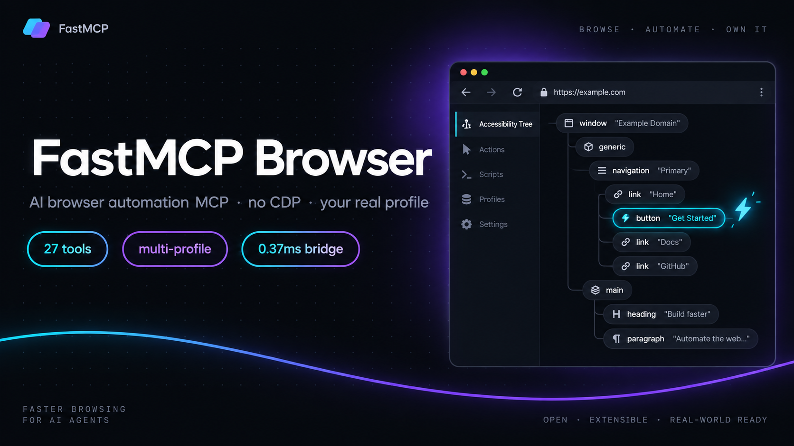

# FastMCP Browser

[](https://github.com/rayss868/fastmcp-browser/actions/workflows/ci.yml)
[](https://github.com/rayss868/fastmcp-browser/releases)
[](LICENSE)



**Lightweight MCP server + WebExtension for AI browser automation — no CDP, no debugger, no Playwright.** Your AI drives *your* real browser: same logins, same extensions, every profile.

- **27 MCP tools**, full schema footprint ≈ **3.1k tokens**
- **Bridge latency**: median **0.37 ms**, p95 **3.15 ms**, **1,414 req/s** (loopback WebSocket benchmark)
- **Tests**: server 21/21, extension 39/39, build green for Chromium + Firefox

---

## Why not Playwright MCP?

`@playwright/mcp` (Microsoft) is excellent — for a *fresh, disposable* browser. FastMCP Browser is built for the opposite case: **the browser you already have open, logged in to everything**.

| | FastMCP Browser | @playwright/mcp | chrome-devtools-mcp | mcp-chrome (extension) |
|---|---|---|---|---|
| Control path | WebExtension APIs only — **no CDP, no `chrome.debugger`** | Playwright (CDP under the hood) | Chrome DevTools Protocol | Chrome extension APIs |
| Browser it drives | **Your real running browser** (Chromium + Firefox) | Launches its own browser instance | Launches/attaches Chrome | Your real Chrome |
| Logged-in sessions | ✅ automatically — it *is* your profile | ⚠️ needs `--extension` mode or profile copying | ⚠️ attach via remote debugging port | ✅ |
| Multi-profile | ✅ `browser_instances` + `browser_use_instance` — all profiles stay connected, switch live | ❌ one instance per launch; second profile overwrites | ❌ single attach target | ❌ single Chrome window focus |
| Session tab group | ✅ auto group `Automation`, survives multi-run | ❌ | ❌ | ❌ |
| Snapshot model | semantic a11y refs (small) | accessibility snapshot (~2–5 KB per snapshot) | a11y + network + traces | DOM/text |
| Install weight | extension + ~0 deps (`ws`, `zod`, MCP SDK) | downloads Playwright browser binaries | downloads Chrome + CDP tooling | extension + native pieces |
| Upload files | ❌ explicit `UNSUPPORTED_CAPABILITY` (no OS file chooser control) | ✅ | ✅ | ✅ |

### Honest strengths of Playwright MCP (and where it still wins)

- Cross-browser (Chromium/Firefox/WebKit) **launch control**: fresh isolated contexts, headless runs, proxy auth, download paths — FastMCP cannot launch browsers or control OS dialogs.
- Ecosystem maturity: official docs, cached snapshots, vision fallbacks, huge community.
- Research (e.g. BrowserGym/Benchmarks-style evals) consistently shows **direct Playwright APIs beat MCP tool wrappers** for large scripted flows — if you are writing a test suite, use Playwright directly, not any MCP.

### Where FastMCP wins

1. **Real session, zero setup** — no profile copy, no re-login, no cookie export. Your 2FA, your CAPTCHA state, your wallets, your open tabs.
2. **No CDP / no `chrome.debugger`** — nothing to attach, nothing for anti-bot layers to see as an automation driver. (Honest caveat: it is still automation on the page — it reduces fingerprints, it is not invisibility.)
3. **Multi-profile as a first class citizen** — two profiles with the same extension connected at once; `browser_instances` lists them (stable `instanceId`, browser brand, active-tab hint), `browser_use_instance` reroutes the bridge. Playwright MCP needs one process per profile.
4. **Persistent session model** — tabs join an `Automation` tab group; the session survives across AI runs and keeps `tabIds` reconciled.
5. **Tiny context cost** — the *entire* 27-tool schema is ~3.1k tokens; snapshots return compact `ref` handles instead of raw DOM.
6. **Loopback-only bridge** — `127.0.0.1:9229`, token-authenticated. No external endpoints, works behind middleware/AI gateways with no proxy config (a known Playwright MCP HTTP/SSE pain point).

## Benchmark

Internal bridge benchmark (`server/benchmarks/bridge-benchmark.mjs`, 50 iterations, authenticated local WebSocket):

```json
{
  "iterations": 50,
  "coldStartMs": 2.735,
  "medianMs": 0.374,
  "p95Ms": 3.146,
  "throughputPerSecond": 1414.43,
  "heapDeltaBytes": 473208
}
```

Context vs the wider MCP browser landscape:

| Metric | FastMCP Browser | @playwright/mcp | Notes / source |
|---|---:|---:|---|
| Bridge round-trip (median) | **0.374 ms** | n/a (in-process driver) | our loopback benchmark |
| Schema footprint (all tools) | **~3.1k tokens / 27 tools** | substantially larger (30 tools, verbose schemas + docs) | measured via `getToolDefinitions()` |
| Reported agent-loop token burn | — | **~114k tokens per test run** | community report, Feb 2026 (see [docs/research-browser-automation.md](docs/research-browser-automation.md)) |
| Browser binaries to install | **0** | 2–3 (Chromium/Firefox/WebKit) | Playwright install weight |
| Connected profiles | **N (multi-instance)** | 1 per launch | |

No honest head-to-head end-to-end latency benchmark exists yet between FastMCP and Playwright MCP — that is tracked as future work in [docs/superpowers/benchmarks](docs/superpowers/benchmarks).

## Architecture

```
┌──────────────┐   stdio (MCP)   ┌──────────────────┐   ws://127.0.0.1:9229   ┌───────────────────────────┐
│  AI client   │ ◄─────────────► │  server (Node)   │ ◄──────────────────────► │  WebExtension (MV3)       │
│  Claude, etc │                 │  tools → bridge  │   token handshake        │  background SW + content  │
└──────────────┘                 └──────────────────┘   multi-instance         │  engine (page MAIN world) │
                                    │  bridge.ts        routing + promote      └───────────────────────────┘
                                    │  tools.ts (27)                                               │
                                    └─ index.ts (MCP SDK, zod)                                     ▼
                                                                                    chrome.* APIs, NO CDP
```

- **server/** — TypeScript MCP server (stdio), WebSocket bridge on `127.0.0.1:9229`.
- **extension/** — MV3 WebExtension for Chromium & Firefox; semantic snapshot engine injected into the page MAIN world.

## Quick start

### Requirements

- **Node.js 22+** (build + `node --test`)
- A **Chromium-based browser** (Chrome/Edge/Brave/Opera/Vivaldi) or **Firefox**
- An **MCP client** (Claude Code, Claude Desktop, or any client supporting stdio MCP servers)

### 1. Build the server

```bash
git clone <your-repo-url> fastmcp-browser
cd fastmcp-browser/server
npm install
npm run build      # outputs dist/src/index.js
```

(`npm run dev` builds and starts the stdio server immediately, useful for a smoke test.)

### 2. Load the extension

**No build needed:** grab `fastmcp-browser-chromium.zip` or `fastmcp-browser-firefox.zip` from the [GitHub Releases](../../releases) page (published automatically on every `v*` tag), unzip, and load the extracted folder (see steps below).

Or build it yourself:

```bash
cd extension
node build.mjs     # writes dist/chromium and dist/firefox
```

- **Chromium/Edge/Brave/Opera/Vivaldi** → `chrome://extensions` → *Load unpacked* → the `chromium` folder
- **Firefox** → `about:debugging` → *Load Temporary Add-on* → `firefox/manifest.json`

The extension auto-connects to `ws://127.0.0.1:9229` and keeps a stable per-profile `instanceId`.

### 3. Register the MCP server in your client

**Option A, MCP Registry (once published):** install the server named `fastmcp-browser` through your client's MCP Registry command; no clone or build needed. Until the registry entry is live, use Option B.

**Option B, download the extension zip** from [GitHub Releases](../../releases) (no build needed), unzip, and load it unpacked (step 2 above).

**Option C, manual config** (`.mcp.json` / `.openclaude.json`), pointing at your local clone:

```json
{
  "mcpServers": {
    "fastmcp-browser": {
      "command": "node",
      "args": ["/path/to/fastmcp-browser/server/dist/src/index.js"],
      "env": { "FASTMCP_PORT": "9229" }
    }
  }
}
```

Token defaults to `fastmcp-local-dev`; override with `FASTMCP_TOKEN` (server + extension must match).

## Tool reference (27)

| Group | Tools |
|---|---|
| Connection & status | `browser_connect`, `browser_status`, `browser_disconnect` |
| **Instance / profile** | `browser_instances`, `browser_use_instance` |
| Tabs & session | `browser_tabs`, `browser_open`, `browser_close`, `browser_focus` |
| Read the page | `browser_snapshot`, `browser_inventory`, `browser_screenshot` |
| Interact | `browser_click`, `browser_fill`, `browser_type`, `browser_press`, `browser_select` |
| Pointer & scroll | `browser_pointer_move`, `browser_pointer_click`, `browser_pointer_drag`, `browser_scroll` |
| Timing | `browser_wait` |
| Data | `browser_cookies`, `browser_storage`, `browser_download`, `browser_evaluate` |
| Upload | `browser_upload` → `UNSUPPORTED_CAPABILITY` (honest, by design) |

### Example session

```text
browser_open     { url: "https://example.com" }   → new tab joins the Automation group
browser_snapshot { }                              → semantic element list with refs
browser_fill     { ref: "r12", value: "hello" }   → set input value + fire change events
browser_click    { ref: "r45", revision: 3 }      → click; revision rejects stale refs
browser_status   { }                              → session, group, and tab state
```

### Multi-profile workflow

```text
browser_instances        → list every connected profile (id, brand, active-tab hint, which is active)
browser_use_instance {id} → reroute all subsequent commands to that profile
browser_tabs / snapshot   → operate inside the selected profile
```

The first-connected profile is active by default; if the active one disconnects, the newest surviving instance is promoted automatically.

## Testing

```bash
cd server   && npm test    # build + 21 unit/workflow/security tests
cd extension && npm test   # 39 session/router/bridge tests
```

Both suites must be green; extension build also runs bundled-syntax and no-CDP integration checks.

## Troubleshooting

- **Extension shows "not connected"** — the MCP server must be running first (it hosts the WebSocket bridge on `127.0.0.1:9229`). Start the server, the extension retries every 1.5 seconds automatically.
- **Port 9229 already in use** — the extension side is fixed to port 9229, so free that port (stop the other process) rather than changing only `FASTMCP_PORT`.
- **Commands time out right after loading the extension** — reload the extension after rebuilding (`node build.mjs`), the service worker may still run the old bundle.
- **`load unpacked` fails** — select the folder that contains `manifest.json` (the `chromium` or `firefox` folder itself).
- **Multiple profiles** — install/enable the extension in each profile you want to control, then use `browser_instances` to confirm both are connected.
- **Token rejected** — `FASTMCP_TOKEN` on the server and the extension must match (`fastmcpToken` in manifest or `fastmcpToken` storage key).

## Contributing

1. Fork and create a feature branch.
2. Keep both suites green: `npm test` in `server/` and `extension/`.
3. Follow the existing TDD workflow: failing test first, then the minimal change.
4. Open a PR describing the behavior change and its test.

## Project structure

```text
├── README.md
├── docs/
│   ├── banner.png                      # README hero
│   ├── research-browser-automation.md  # landscape research (Playwright MCP, CDP, extension MCPs)
│   └── superpowers/                    # design spec, plan, baseline benchmark
├── server/
│   ├── src/        # index.ts (MCP), bridge.ts (multi-instance WS), tools.ts (27 registry)
│   ├── tests/      # 21 tests
│   └── benchmarks/ # bridge-benchmark.mjs
└── extension/
    ├── src/        # background SW, session, router, content engine
    ├── assets/     # icon.png + icons/ 16-32-48-128
    ├── tests/      # 39 tests
    └── dist/       # build output (gitignored): chromium/ + firefox/  ← load these unpacked
```

## Limitations (on purpose)

- **File upload** unavailable — extensions cannot drive the OS file chooser.
- **No network interception/capture** beyond page-level observe, no browser debugger protocol.
- **No headless / browser launching** — it automates browsers that are already running.
- Screenshot is bitmap (viewport capture), not full-page vector output.

## More

- [docs/research-browser-automation.md](docs/research-browser-automation.md) — full landscape research & comparison notes
- [docs/superpowers/specs](docs/superpowers/specs) — original design spec
- [docs/superpowers/benchmarks](docs/superpowers/benchmarks) — baseline + verification results

## License

[MIT](LICENSE)
